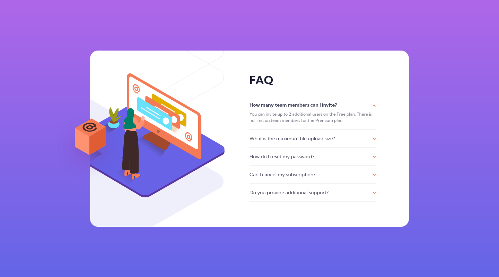

# Frontend Mentor - FAQ accordion card solution

This is a solution to the [FAQ accordion card challenge on Frontend Mentor](https://www.frontendmentor.io/challenges/faq-accordion-card-XlyjD0Oam). Frontend Mentor challenges help you improve your coding skills by building realistic projects.

## Table of contents

- [Overview](#overview)
  - [The challenge](#the-challenge)
  - [Screenshot](#screenshot)
  - [Links](#links)
- [My process](#my-process)
  - [Built with](#built-with)
  - [Useful resources](#useful-resources)
- [Author](#author)

## Overview

### The challenge

Users should be able to:

- View the optimal layout for the component depending on their device's screen size
- See hover states for all interactive elements on the page
- Hide/Show the answer to a question when the question is clicked

### Screenshot

### Links

- Solution URL: [GitHub](https://github.com/GrzywN/faq-accordion-card-main)
- Live Site URL: [Netlify](https://heroic-tulumba-908749.netlify.app/)

## My process

### Built with

- Semantic HTML5 markup
- CSS & SCSS
- Flexbox / CSS Grid
- Mobile-first workflow
- Figma

### Useful resources

- [ Julio Codes ](https://www.youtube.com/watch?v=MXrtXg1kpVs) - This helped me in doing this accordion card without JS. It was really fun to use :target attribute. I would never came up with this idea myself.

## Author

- Frontend Mentor - [@grzywn](https://www.frontendmentor.io/profile/grzywn)
- Twitter - [@grzywn](https://www.twitter.com/grzywn)
